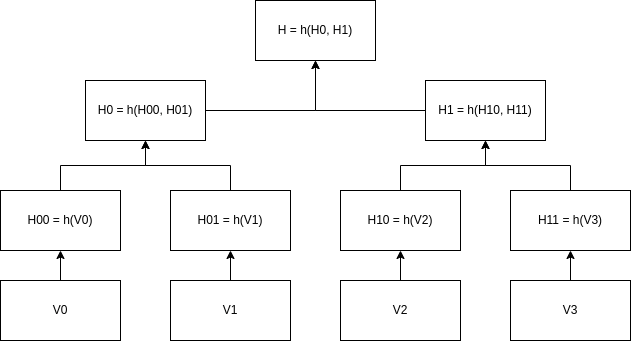

# Merkle Tree Assignment

## Impl note
For simplicity, a tree was made that does not store intermediate nodes and considers the root at the time of the request. In general, the transition to incremental counting can be done quite simply.

## Challenge description
Implement a Merkle Tree in Rust. Our Merkle Trees have a height >= 0. The height is the number of levels above the leaves. This means the simplest tree has height 0 and is just a single value hashed into a single leaf. Below you can find an example, where the Vx are the values stored into the Merkle Tree and h is some hash function:

A Merkle tree of height 2 would look like this:

The Merkle Opening of a value is the partners with which a given leaf is hashed to reconstruct the root. In the example above, the opening of H01 would be [H00, H1].

If a leaf has not been inserted into yet, the default value of a leaf is h(0).

### Requirements:

Your implementation should support the following operations: 

- Insert: Your implementation provides a way to insert a value into the tree. 
- Get Root: Your implementation provides a way to get the root of the tree at any given time.
- Get Value: Your implementation provides a way to fetch the a leaf (i.e. the hash of some value) stored at a provided index.
- *Optional:* Get Opening: Your implementation provides a way to fetch the opening of the leaf at a provided index.

### Additional Information:
- We do not know what *hash function* our Merkle Tree will use yet. Your implementation should be generic enough that we can easily adapt to using a different hash function without changing much code.
- We do not know what *height* our Merkle Tree will have yet. Your implementation should be generic enough, that we can easily adapt to using a different height without changing much code.
- Your implementation should run smoothly for height <= 10.
